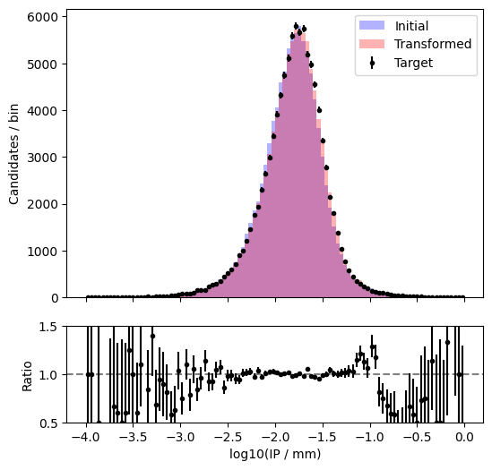

# ip-calibration-with-nflows
Small project to investigate if the mismodelling in the LHCb simulation of the muon impact parameter resolution of Z decays can be corrected/described using normalising flows.



The repository is divided into exploratory Jupyter notebooks under `notebooks/` and python scripts under `scripts/`. The latter are culminations of the former that could be used in production.

`notebooks/tutorial.ipynb` essentially implements the `nflows` [tutorial](https://pypi.org/project/nflows/) - I also looked in the `moons` tutorial for some help.
This was all neatened up into a script under `scripts/tutorial.py`.

`notebooks/flow_to_lhcb_ip_sim.ipynb` shows my attempts at building a normalising flow that can flow from a Gaussian base distribution to the simulation log10(IP) distribution of Z-> mu mu decays in LHCb. I eventually converged on a quadratic spline flow which worked well.

`notebooks/extracting_transformations.ipynb` shows investigations in how to extract the trained transformation from a flow, its inverse, and how to then put two transformations together.

## Setup instructions

Before running any of the python scripts, setup the environment with:

```bash
source setup_python_env.sh
```

Then you can execute any of the python scripts within from the top-level directory e.g.

```
[user@users-computer ip-calibration-with-nflows]$ ./scripts/tutorial.py
```
